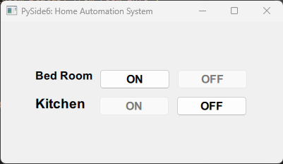

# Qt Quick User Interface

Qt Quick base on **Pyside6** is a Python binding of the cross-platform and standard Python interface GUI toolkit Qt. This is a simple Pyside6 user interface with PostgreSQL database.


## Requirements
To run this application, you will need:

* [Python3.x](https://www.python.org/downloads/) or higher
* [PySide6](https://pypi.org/project/PySide6/)
* [psycopg2](https://pypi.org/project/psycopg2/)

You will also need access to a [PostgreSQL](https://www.postgresql.org/) database.


## Installation

1. Clone this repository to your local machine.
2. Install the required Python modules by running the following command in your terminal.
3. Edit the config.ini file to include your PostgreSQL database credentials.

```bash
pip install -r requirements.txt
# or (Linux / MacOS)
sudo pip install -r requirements.txt
```


## Folder Structure

```bash
Qt-Quick/
│
├── screenshots/
├── main.py
├── main.qml
├── README.md
└── requirments.txt
```


## Usage
To run the application, simply run the following command in your terminal:

```css
python main.py
```


## Screenshots

Here are some screenshots of the `Qt Quick` project:

**Main Window**<br/>
<br/>


**Note:** If show this type of error in windows11.

**_QSqlDatabase: QPSQL driver not loaded_** <br/>
**_QSqlDatabase: available drivers: QSQLITE QODBC QPSQL_**

 * Then open your _Command Prompt_ and type this command or you need to add to the Postgres bin folder to the environment _PATH_.

 ```bash
 # i'm using PostgreSQL version 15
 SET PATH=%PATH%;C:\Program Files\PostgreSQL\15\bin
 ```

This will launch the PySide6 user interface. From there, you can create, read, update, and delete records in the connected PostgreSQL database.