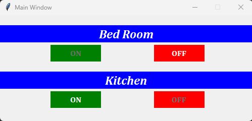

# Desktop User Interface

The Desktop user interface (UI) is the point of human-computer interaction and communication in a device. This can include display screens, keyboards, a mouse and the appearance of a desktop. It is also the way through which a user interacts with an application or a website.

## Types of UI

There is two types of user interface:

* [Tkinter](https://en.wikipedia.org/wiki/Tkinter#:~:text=Tkinter%20is%20a%20Python%20binding,and%20macOS%20installs%20of%20Python.&text=The%20name%20Tkinter%20comes%20from%20Tk%20interface) (Python default GUI interface).
* [Qt Quick or QML](https://doc.qt.io/qt-6/qtquick-index.html)

## Project Screenshots

Here are some screenshots of the `Tkinter` and `Qt Quick` project:

**Tkinter Window** 
 
**Qt Quick Window** 
 