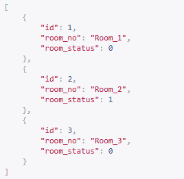
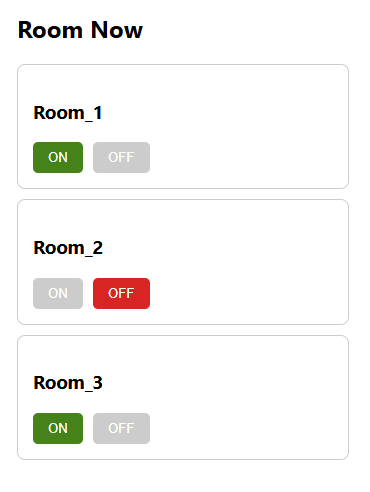

# Web User Interface

A **web based** application built with **Python Django** for the backend and **ReactJS** for the frontend. It provides a responsive user interface, interacts with **REST APIs** and allows seamless communication between the client and server for dynamic web functionality


## Project Structure

```bash
backend/     # Django project
frontend/    # ReactJS project
screenshots/
README.md
```


## Backend (Django)

- Python 3.x
- Django 4.x
- Django REST Framework
- SQLite (default DB, can change to PostgreSQL)
- REST API endpoints for frontend

### Run Backend

```bash
cd backend
python manage.py migrate
python manage.py runserver
```
API runs on: `http://127.0.0.1:8000/`


## Frontend (ReactJS)

- React 18+
- Axios (for API calls)
- Node.js 18+
- npm or yarn package manager

### Run Frontend

```bash
cd frontend
npm install
npm start
```
Frontend runs on: `http://localhost:3000/`


## Connecting Frontend & Backend

- React fetches data from Django REST API (default `http://127.0.0.1:8000/`)
- Update axios base URLs if backend runs on a different port or host.


## Features

- Full CRUD API with Django REST Framework
- React frontend for UI
- Axios for HTTP requests
- Supports JSON responses


## Project Screenshots

Here are some screenshots of the `Django` and `ReactJS` project:

**Django**<br/>
<br/>
**ReactJS**<br/>
<br/>